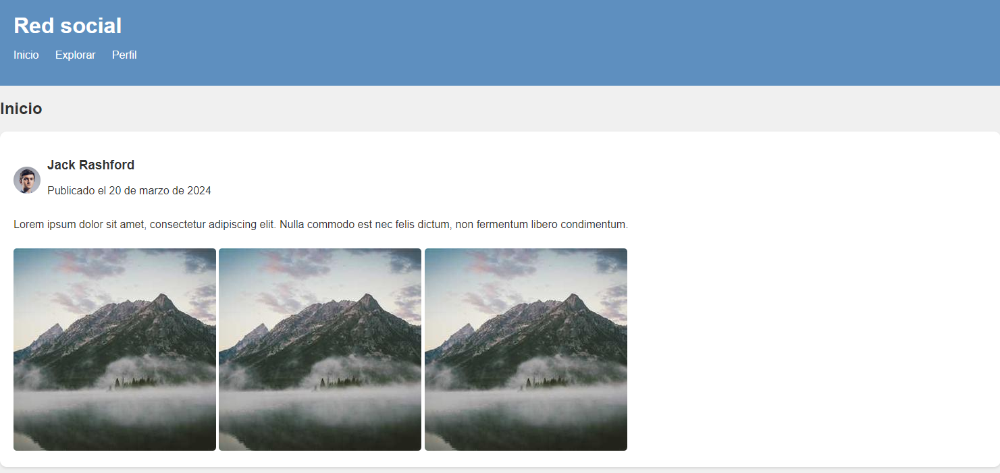
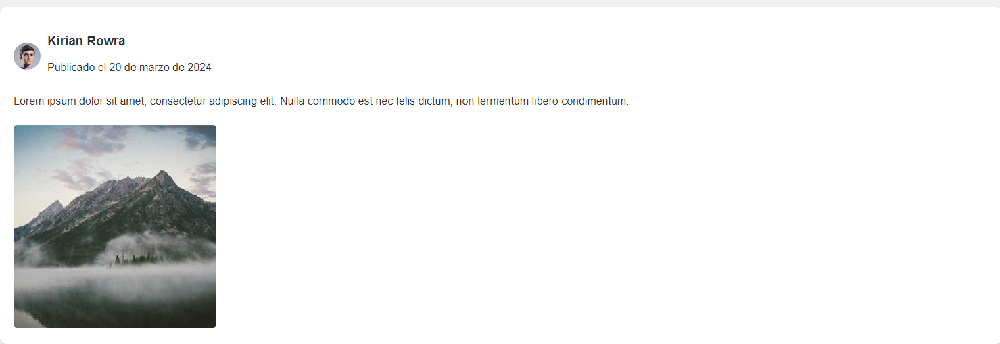

# Tarea

## Descripción de la Tarea

**Descripción:**
En esta tarea, deberán crear el contenido inicial para una red social mejorada utilizando HTML y aplicando el modelo de caja (box model) y Flexbox para el diseño. La red social contendrá una estructura más elaborada con secciones para la cabecera, el contenido principal y el pie de página.

**Instrucciones:**

1. Crea un documento HTML que contenga la estructura básica de una página web
2. Utiliza etiquetas HTML semánticas para dividir la página en secciones significativas, como cabecera, contenido principal y pie de página.
3. Diseña la cabecera de la red social incluyendo un título y un menú de navegación con enlaces a diferentes secciones de la página.
4. En el contenido principal, crea al menos seis publicaciones de usuario con texto e imágenes de ejemplo, cada una con información simulada como nombre de usuario, fecha de publicación y texto descriptivo.
5. Utiliza Flexbox para organizar las publicaciones en una disposición de cuadrícula flexible y adaptativa.
6. Aplica estilos CSS para mejorar el aspecto visual de la página, como colores de fondo, tipografía, bordes redondeados y sombras.
7. Asegúrate de que la página sea responsive y se vea bien en dispositivos de diferentes tamaños.

**Entrega:**

1. Sube tu archivo HTML y cualquier archivo CSS externo a la plataforma de entrega designada por el profesor.
